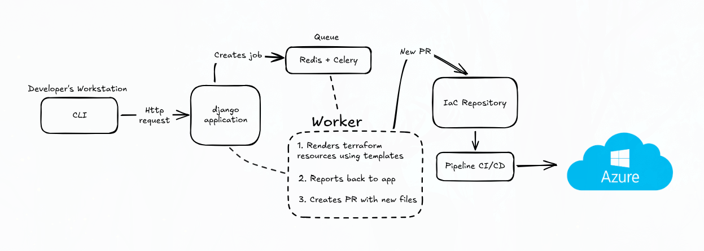
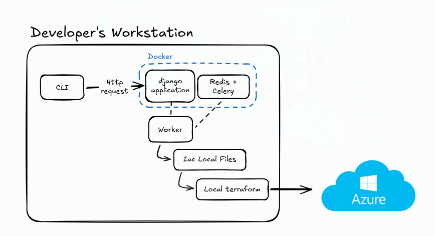

# Real platform vs. this demo

This document explains which parts of the Conduit architecture are represented faithfully by this repository and which parts are intentionally simplified so the demo can be reproduced from a developer workstation.

## Real platform architecture

The intended platform separates the Django control plane from a remote execution plane.



The worker and CI/CD system handle the downstream repository, infrastructure, and image workflows.

## This demo

The local demo keeps the same control-plane boundary but replaces remote execution with local services and commands.



The worker generates local Terraform; `make iac-pipeline` applies it, and `make deploy-app` builds and publishes the demo image separately.

## Comparison

| Concern | Real platform | This demo |
|---|---|---|
| CLI/API | Go CLI and Django API | Go CLI and Django API |
| Authentication | Microsoft Entra | Microsoft Entra |
| Queue | Redis/Celery or managed equivalent | Local Redis/Celery |
| Worker | Remote execution service | Host-side Python worker |
| IaC source of truth | Git repository | Local generated IaC files |
| Change review | Pull request | Interactive Terraform approval |
| Terraform execution | CI/CD pipeline | `make iac-pipeline` |
| Image build | CI/CD pipeline | `make deploy-app` |
| Image registry | Shared/private ACR | Shared Basic ACR |
| Workload target | Azure Container Apps | Azure Container Apps |
| Terraform state | Remote managed state | Local non-production state |
| Credentials | Managed identity or service connection | Developer's Azure CLI session |
| Application source | Developer repository | Bundled `examples/simple-api` |
| Deployment status | Platform-visible deployment lifecycle | Local command output only |

## What remains faithful

The demo preserves the important control-plane and execution-plane ideas:

- authenticated CLI-to-Django communication;
- authenticated identity mapped to a Platform User;
- immutable provisioning job payloads;
- asynchronous queue processing;
- a separate worker boundary;
- generated Terraform as workload desired state;
- explicit approval before infrastructure apply;
- ACR-backed image deployment;
- managed identity for Container App image pulls;
- Azure Container Apps as the workload target;
- cleanup of workload and bootstrap resources through Terraform.

## What is simplified

The demo deliberately omits:

- remote Git providers;
- pull requests;
- CI/CD service connections;
- remote workers;
- remote Terraform state;
- production approval policy;
- team-level authorization;
- deployment status callbacks;
- arbitrary application source repositories;
- production networking and observability;
- application destruction as a separate user-facing workflow.

The demo's `deploy-app` command is therefore not pretending to be the final deployment architecture. It is a local stand-in for the build-and-deploy stage that a future CI/CD pipeline would perform.

## Command mapping

```text
Real platform request
  → CLI/API
  → queue
  → worker
  → pull request
  → CI/CD

Demo request
  → CLI/API
  → queue
  → worker
  → generated local Terraform
  → make iac-pipeline
  → make deploy-app
```

The durable architectural decisions are recorded in [ADR 0003](adr/0003-keep-provisioning-outside-the-django-control-plane.md), [ADR 0004](adr/0004-use-container-apps-for-demo-workloads.md), and [ADR 0005](adr/0005-use-shared-acr-and-separate-app-deployment.md).
